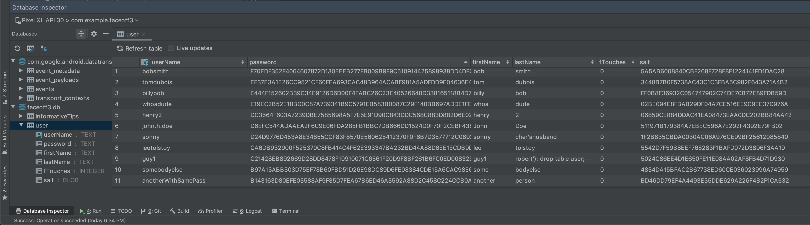

# FaceOff - an Android project to help you touch your face less, wash your hands more, and be safer during the coronavirus pandemic

Studies show that two thirds of face touches [occur with the non-dominant hand](https://pubmed.ncbi.nlm.nih.gov/32591572/), which is also the hand most people wear a watch on. This means that through a combination of automatic face-touching detection and hand-washing detection, performed by a smart watch linked to the FaceOff smartphone app, healthier combinations of these two habits can be promoted through wrist vibration warnings and taps, before and after face touches, as well as through gamification and up-to-date, customized county-level travel advisories, whether that’s for those who must travel for work and want to know which counties are safer to stop in (such as semi truck drivers), or for those who just want to shop for their groceries in whichever county currently has the lowest incidence rate.

  

## Running the app

NB: This app is our team's final project for CSCI 3308, Software Development Methods and Tools, and remains, at best, a work-in-progress. There are many features we did not have time to implement, such as the companion smart watch app for Wear OS, nor any automatic face-touch tracking. And we make no claim that this app can prevent, treat, or diagnose SARS-CoV-2 infection, of course. (After all, this is just a final project, not a 'real' app)

You can run the app in Android Studio's Android Virtual Device/Emulator, whose requirements you can read about [here](https://developer.android.com/studio/run/emulator). 

In Android Studio:
1) Go to **File > New > Project from Version Control...**
2) Make sure **Git** is selected in the version control drop down box of the resulting promt
3) Paste **https://github.com/MarcNettles/FaceOff3** into the URL field and hit the **Clone** button

## Main features and functionality

This app utilizes a few API and SDKs, including:
* The Google [Maps SDK for Android](https://developers.google.com/maps/documentation/android-sdk/overview)
* The [Google Places API](https://cloud.google.com/maps-platform/places/) and specifically [Place Autocomplete](https://developers.google.com/places/web-service/autocomplete)
* The hourly-updating [ESRI COVID-19 GeoJSON layer API](https://hub.arcgis.com/datasets/kygeonet::us-covid-19-cases), maintained by the Center for Systems Science and Engineering (CSSE) at The Johns Hopkins University, and supported by Esri Living Atlas team and JHU Data Services
* A GeoJSON [US county boundary file](https://eric.clst.org/tech/usgeojson/) converted from the United States Census Cartographic Boundary Files by [Eric Celeste](https://eric.clst.org/index.html)

We had several goals in this project, some of which we achieved and others which we did not quite have time for. 

### Achieved goals and features:

We:
* learned a lot about git and GitHub
* practiced agile methodology for developing this app
* learned how to work remotely! (since we were completely remote for the semester)
* applied what we learned in our Data Structures class, and recognized the hash map to be an efficient way to store and quickly retrieve the data for all 3,143 US counties in the ~25 MB of text in the GeoJSON US county boundary file, rather than search the entire GeoJSON file each and every time any one of the county markers is clicked on/tapped. We did this by separating out each county from the main GeoJSON file and turning each into its own complete GeoJSON file, and then storing each one in a hashmap object, so upon tapping a county marker, that marker's id could be hashed and then used as an index into the hash map/table.
* Some of us had never done anything in Java, so this was a great learning experience for that
* got experience with several parts of the Maps for Android SDK's utility library, including the [GeoJSON utility](https://developers.google.com/maps/documentation/android-sdk/utility/geojson), the [Multilayer utility](https://developers.google.com/maps/documentation/android-sdk/utility/multilayer), the [Marker Clustering utility](https://developers.google.com/maps/documentation/android-sdk/utility/marker-clustering) (which we got working but decided not to keep since, by design, it reduces the number of markers on the map, and in our case, visualizing each and every county's color-coded COVID incidence rate at once was a useful effect), and also got experience using custom [Markers](https://developers.google.com/maps/documentation/android-sdk/marker), [Info Windows](https://developers.google.com/maps/documentation/android-sdk/infowindows), and [Shapes/Polygons](https://developers.google.com/maps/documentation/android-sdk/shapes)
* got experience requesting user location permissions and forwarding those permissions to the Map fragment for actually representing current location on the map

* We put in a fun little white blood cell animation on the home screen that the user can 'care for' by having a good ratio of face touches to hand washes. We called him 'the Tamagotchi' and decided that this character could help motivate the user to pay closer attention to their handwashing and face-touching behaviors through gamification:

  

* We got our Maps search box to successfully send user queries to the Google Places API autocomplete search box, so that autocomplete predictions would be sent back for the user to choose from. We were also able to [bias](https://developers.google.com/places/web-service/autocomplete#location_biasing) the results sent back based on user location:

  

* We got an SQLite database linked up and working with the app, and managed to salt and hash users' passwords on the device *before* storing them in the database, so that even if two users had the same password, anybody looking at the database could not tell. Since we know that roll-your-own implementations of security concepts are themselves apt to be flawed and can become threat vectors, this was more of an exercise in understanding the process of salting and hashing passwords than an attempt to have perfect security. We followed what the textbook for ECEN 4133 (Fundamentals of Computer Security), Security Engineering (2020) by Ross Anderson says, which is that "in modern Linux distributions, passwords are salted, hashed using 5000 rounds of SHA-512, and stored in a file hash that only the root user can read." (We did do 5000 rounds of hashing, but used SHA-256 instead of 512):

### What we'd do in the future:

* Develop a companion app for Wear OS. This app would provide vibration notifications when face touching is detected, detect when the user is washing their hands, and gather accelerometer and gyroscope readings and send them off to the paired phone for processing. With machine learning on that data, we could train the app to better recognize face touches and hand washing.
* Get the Places autocomplete search box fragment to actually 'communicate' it's chosen prediction to the map, and move the 'camera' to that location
* Actually store user face-touches in the database, so they are persistent across sessions of the app being opened, and store them in some obfuscated/secured way
* Polish the UI more

YSK (You should know!): Google actually implemented a COVID-19 Info layer into their regular Maps app! This happend right in the middle of the semester while we were trying to kind of do the same thing with their SDK (along with probably many others). You can read more about the COVID-19 Info layer [here](https://blog.google/products/maps/navigate-safely-new-covid-data-google-maps/).
